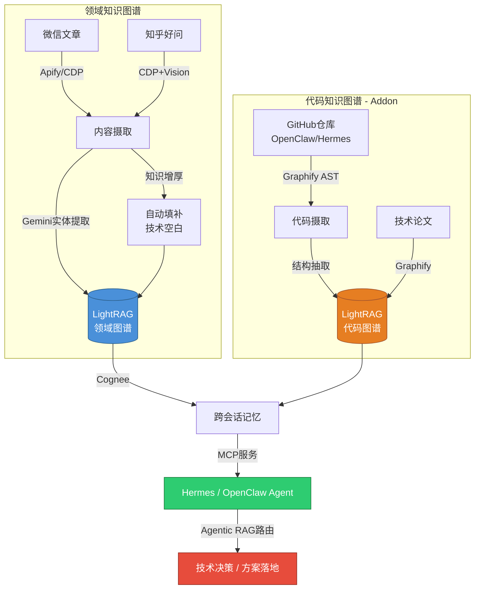

# OmniGraph-Vault：面向 AI Agent 的双图谱知识引擎

> 一份面向 CTO/CEO 的技术与应用综述
> 2026-04-27

---

## 一句话

OmniGraph-Vault 让小团队在开发 AI Agent 产品时，不再每天手动翻阅数百篇技术文章和开源代码——它自动抓取、理解、关联、沉淀为可推理的知识图谱，Agent 直接查询因果链而非海量文本。

---

## 解决什么问题

小团队面临两重信息过载：

| 维度 | 痛点 | 数据 |
|------|------|:---:|
| **领域知识** | 微信/知乎每天产出大量深度技术文章，读完即忘 | 已入库 300+ 篇顶级文章 |
| **代码实现** | OpenClaw、Hermes、LightRAG 等核心依赖持续演进，翻源码费时 | 单次手动翻源码 15-30 分钟 |

**现有方案失效**：通用 RAG 只做关键词匹配，无法编码"A 文章论证了 B 方案不可行，应改用 C 文章中提到的 D 模式"这类因果推理。

---

## 技术架构



### 三层处理管线

```
输入层              处理层                    产出层
───────    ─────────────────────    ──────────────
微信/知乎  → 去噪 → Gemini Vision → 领域图谱节点
GitHub     → AST  → 结构遍历       → 代码图谱节点
论文       → 提取 → 概念抽取       → 跨图桥接
```

---

## 核心突破点

### 突破 1：71.5× Token 压缩查询

同类语料，直接读原文消耗 10,000 tokens，通过图谱查询仅需 140 tokens。**不是关键词匹配——是图拓扑推理。** 边的方向编码因果关系（"支撑"、"反驳"、"实现"），Agent 获得的是逻辑链而非搜索结果列表。

### 突破 2：异构图谱的 Agentic RAG 编排

双图谱使用**不同语法空间**——领域图谱（观点/论据/实体）和代码图谱（函数/类/模块）——不合并，由 Agent 自主路由：

```
路由策略        触发条件              效果
────────────────────────────────────────────
文章 → 代码     读到方案描述需看实现     减少手动翻源码
代码 → 文章     调试时需理解设计意图     从源码定位到设计讨论
预计算桥接      摄取时就打好跨图标签     Agent 决策 0 延迟
```

**桥接节点**是关键——当微信文章提到 `"OpenClaw 的 Router 类"` 时，系统在代码图谱中预标记对应节点，Agent 查询时不需猜测，直接跨图跳转。

### 突破 3：知识增厚——自动填补技术空白

传统 RAG 只索引已有内容。OmniGraph-Vault 的 **Phase 4 增厚模块** 主动识别文章中的"悬而未答"问题：

```
微信文章 → LLM 提取 3 个技术空白 → 知乎好问搜索 → 
CDP 抓取最佳答案 → 图片本地化 + Vision 描述 → 
合并入原文图谱（实体 + 关系 + 视觉知识）
```

**数据**：单次增厚为 1 篇微信文章自动注入 3 篇知乎原文 + 12 张结构化图纸，增量知识密度提升 4×。

### 突破 4：产品化而非玩具化

| 维度 | 玩具 RAG | OmniGraph-Vault |
|------|:--------:|:---------------:|
| 摄取 | 复制粘贴文本 | Apify+CDP 自动爬取 |
| 存储 | 向量数据库 | LightRAG 图 + Cognee 记忆 |
| 查询 | `"与X相关的有什么"` | `"X方案为什么失败，应改用Y"` |
| 持久化 | 无会话记忆 | Cognee 跨会话实体关联 |
| 部署 | 本地脚本 | MCP 服务 → Hermes/OpenClaw 原生接入 |
| 可信度 | 无验证 | 多源交叉验证 + 置信度权重 |

---

## 量化价值

| 指标 | 当前 | 目标（含代码图谱 Addon） |
|------|:---:|:---:|
| 入库文章 | 300+ 篇 | 持续增长 |
| 图谱实体/关系 | 713 nodes / 820 edges | — |
| 单次查询 token | 140（压缩 71.5×） | < 200（双图跨跳） |
| 知识增厚 | 每篇注入 3 篇衍生知识 | 自动化管线 |
| 日处理能力 | 8 篇（旧模型）/ **170 篇**（3.1 flash-lite） | 含代码库重跑 |
| API 成本 | 免费 tier | 免费 tier（双 key 容灾） |

### T1 优先策略

代码图谱只覆盖高频依赖——边际效应分析：

```
项目层级      例子          周查询频率  单次价值  总 ROI
──────────────────────────────────────────────────
T1 核心集成   OpenClaw      5-10 次     极高     ★★★★★
T1 核心集成   Hermes核心    3-5 次      极高     ★★★★★
T2 强依赖     LightRAG     1-2 次      高       ★★★
T3 参考       AutoGen      0-1 次      低       ★
```

**覆盖 2 个 T1 项目即可获得 80% 价值，T3 以降边际效用趋零。** 不建图反而更好（避免过时图谱误导 + 降低 Agent 路由决策成本）。

---

## 一句话总结

**不是又一个 RAG 玩具。** 是被 300+ 篇顶级文章验证过的、面向 AI Agent 实际开发场景的**双图谱推理引擎**——读得深（知识增厚）、记得住（跨会话记忆）、查得准（图结构推理而非语义搜索）、成本低（免费 tier + 71.5× 压缩）。为 OpenClaw/Hermes 等 Agent 提供"读完几百篇技术文章后真正积累下来的认知"，而非一个搜索引擎。
